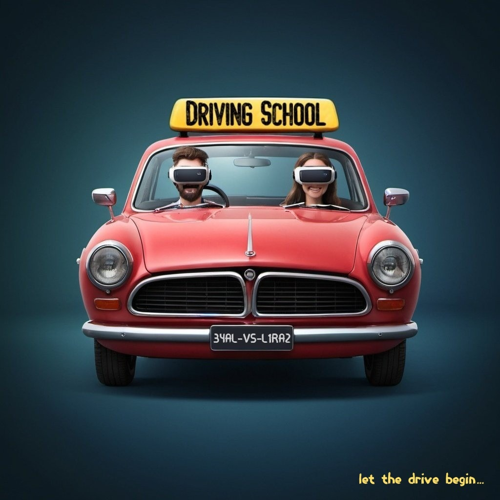

# Driving-School

You can watch the game trailer [here](https://www.youtube.com/watch?v=X-T2e2Gu6Z8&t=6s).

This is a virtual reality driving school simulation game. It simulates driving a car and incorporates real-world elements—roads, traffic signs, pedestrians, other vehicles, and more. The project is designed to teach people how to drive and help them prepare for driving lessons and practical tests—all from the comfort of their home!

The application allows users to set specific driving conditions and difficulty levels in advance, such as the number of pedestrians, cars, night mode, required turns to win, etc. Users can practice particular driving skills and develop new ones as much as they like. For example, they can focus on turns, yielding, checking mirrors, and interacting with other cars.

Before approaching a junction, the student will receive instructions from the instructor on which turn to take, supported by visual cues.

Players can create custom routes based on their mistakes to improve their driving skills. This feature enables players to experience a variety of track types they might not encounter often—or at all—in real lessons. Once a route is created, it will be uploaded to Firebase and made available on the VR platform instantly.

The player receives real-time feedback on any mistakes made during the drive. If too many mistakes are made, you lose! Additionally, at the end of each lesson, a summary of the mistakes is presented, and the score is saved.

The game also features NPC cars that follow traffic laws, enhancing the realism of the driving experience. Each car operates independently based on its sensors and traffic rules.

Lastly, there’s an option to practice parking—both parallel and perpendicular parking spots.

